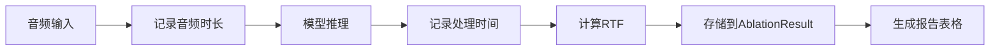

## 产品概述

在关键词识别(Keyword Spotting)项目的消融实验结果表格中添加RTF（Real-Time Factor）指标，用于评估模型的实时处理能力。RTF = 处理时间 / 音频时长，RTF小于1表示模型可以实时处理音频。

## 核心功能

- 在AblationResult数据类中添加RTF属性字段
- 在消融实验运行过程中记录音频时长
- 基于处理时间和音频时长计算RTF值
- 在实验结果报告表格中新增RTF列展示

## 技术栈

- 语言：Python
- 现有框架：基于项目现有的消融实验框架

## 技术架构

### 模块划分

- **配置模块 (config.py)**：扩展AblationResult数据类，添加audio_duration和rtf属性
- **实验运行模块 (run_ablation_trained.py)**：记录音频时长，计算RTF值
- **报告生成模块**：更新表格生成逻辑，添加RTF列

### 数据流



## 实现细节

### 核心目录结构

```
keyword-spotting/
├── config.py                    # 修改：AblationResult添加RTF字段
└── run_ablation_trained.py      # 修改：记录音频时长并计算RTF
```

### 关键代码结构

**AblationResult扩展**：在现有数据类中添加音频时长和RTF属性。

```python
@dataclass
class AblationResult:
    # 现有字段...
    time: float              # 处理时间（已有）
    audio_duration: float    # 音频时长（新增）
    rtf: float              # RTF指标（新增）= time / audio_duration
```

**RTF计算逻辑**：在推理完成后计算RTF值。

```python
# RTF计算
audio_duration = audio_length / sample_rate  # 音频时长（秒）
rtf = processing_time / audio_duration
```

### 技术实现计划

1. **问题**：当前缺少RTF指标
2. **方案**：扩展数据结构，在推理流程中采集音频时长并计算RTF
3. **步骤**：

- 修改config.py中的AblationResult类
- 在run_ablation_trained.py中获取音频时长
- 计算RTF并存储
- 更新报告表格输出

## Agent Extensions

### SubAgent

- **code-explorer**
- 用途：探索项目代码结构，定位config.py中AblationResult类的定义、run_ablation_trained.py中的推理逻辑和报告生成代码
- 预期结果：获取现有代码结构和实现细节，确保修改方案与现有代码风格一致