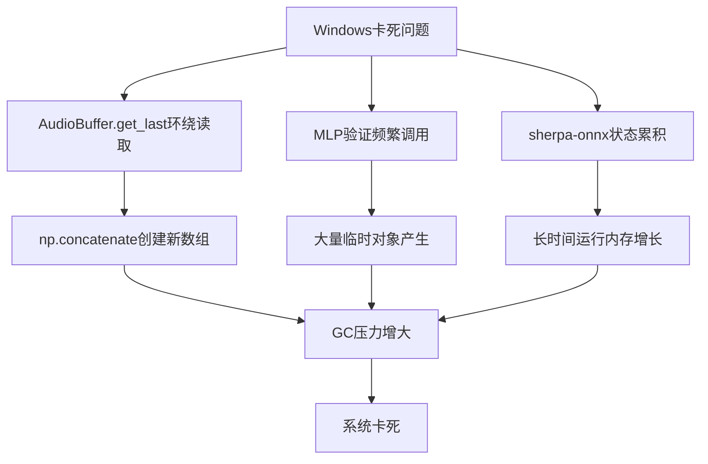
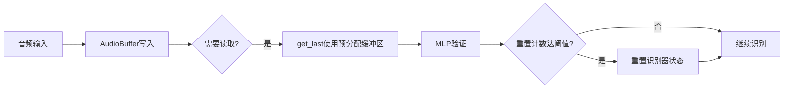

## Product Overview

修复Windows平台运行关键词检测系统时出现的卡死问题。主要针对音频缓冲区内存分配优化和长时间运行状态累积问题进行修复。

## Core Features

- **AudioBuffer.get_last()优化**：减少环绕读取时np.concatenate产生的临时数组分配，降低GC压力
- **定期状态重置机制**：添加sherpa-onnx识别器的周期性重置，防止内部状态累积导致的性能下降
- **内存分配优化**：预分配输出缓冲区，避免MLP验证频繁调用时的重复内存分配

## Tech Stack

- 语言：Python
- 音频处理：numpy
- 语音识别：sherpa-onnx

## Tech Architecture

### 问题分析



### 优化方案

#### 1. AudioBuffer优化

- 预分配输出缓冲区，避免每次get_last()调用时创建新数组
- 使用np.copyto替代np.concatenate进行数据拷贝
- 环绕读取时直接写入预分配缓冲区

#### 2. 状态重置机制

- 添加识别器定期重置计数器
- 每隔N次识别后自动重置sherpa-onnx流状态
- 重置时机选择在静音期间，避免打断正常识别

### Data Flow



## Implementation Details

### 修改文件结构

```
project-root/
├── src/
│   ├── audio_buffer.py      # 修改：优化get_last()方法
│   └── keyword_spotter.py   # 修改：添加状态重置机制
```

### Key Code Structures

**AudioBuffer优化方案**：预分配输出缓冲区，减少内存分配

```python
class AudioBuffer:
    def __init__(self, max_samples: int):
        self.buffer = np.zeros(max_samples, dtype=np.float32)
        # 预分配输出缓冲区
        self._output_buffer = np.zeros(max_samples, dtype=np.float32)
    
    def get_last(self, num_samples: int) -> np.ndarray:
        # 使用预分配缓冲区，避免np.concatenate
        output = self._output_buffer[:num_samples]
        # 直接拷贝数据到预分配缓冲区
        if self.write_pos >= num_samples:
            np.copyto(output, self.buffer[self.write_pos - num_samples:self.write_pos])
        else:
            # 环绕读取：分段拷贝
            first_part = num_samples - self.write_pos
            np.copyto(output[:first_part], self.buffer[-first_part:])
            np.copyto(output[first_part:], self.buffer[:self.write_pos])
        return output
```

**状态重置机制**：定期重置sherpa-onnx识别器状态

```python
class KeywordSpotter:
    RESET_INTERVAL = 1000  # 每1000次识别后重置
    
    def __init__(self):
        self._recognition_count = 0
    
    def _maybe_reset_state(self):
        self._recognition_count += 1
        if self._recognition_count >= self.RESET_INTERVAL:
            self._reset_recognizer()
            self._recognition_count = 0
    
    def _reset_recognizer(self):
        # 重置sherpa-onnx流状态
        if hasattr(self, 'stream'):
            self.stream = self.recognizer.create_stream()
```

### Technical Implementation Plan

#### 问题1：AudioBuffer内存分配优化

1. **问题描述**：环绕读取时np.concatenate创建临时数组
2. **解决方案**：预分配输出缓冲区 + np.copyto分段拷贝
3. **关键技术**：numpy内存视图、原地操作
4. **实现步骤**：

- 在__init__中预分配_output_buffer
- 修改get_last使用np.copyto替代np.concatenate
- 返回预分配缓冲区的视图

5. **验证方式**：使用memory_profiler监控内存分配

#### 问题2：长时间运行状态累积

1. **问题描述**：sherpa-onnx长时间运行内部状态累积
2. **解决方案**：定期重置识别器流状态
3. **关键技术**：计数器触发、流重建
4. **实现步骤**：

- 添加识别计数器
- 达到阈值时调用create_stream重建流
- 重置计数器

5. **验证方式**：长时间运行测试，监控内存占用趋势

### Performance Optimization

- 预分配缓冲区避免频繁内存分配
- np.copyto比np.concatenate更高效
- 定期重置防止内存泄漏
- 重置间隔可配置，平衡性能与稳定性

## Agent Extensions

### SubAgent

- **code-explorer**
- Purpose：探索现有代码库，定位AudioBuffer类和KeywordSpotter类的具体实现位置和当前逻辑
- Expected outcome：获取需要修改的文件路径、类结构和方法签名，确保修改方案与现有代码兼容