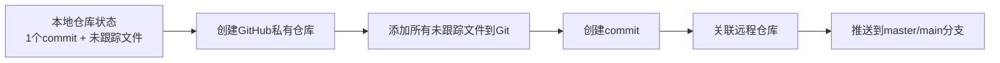

## Product Overview

创建GitHub私有仓库并将本地代码完整推送到master/main分支，确保所有未跟踪文件都被纳入版本控制。

## Core Features

- 创建GitHub私有仓库
- 添加本地所有未跟踪文件（包括.gitignore、部署工具、文档等）
- 提交代码变更
- 推送本地代码到GitHub远程仓库的master/main分支

## Tech Stack

- 版本控制：Git
- 代码托管平台：GitHub
- API工具：GitHub MCP Server

## Tech Architecture

### System Architecture

本任务主要涉及Git和GitHub的交互流程：
本地Git仓库 → GitHub API创建仓库 → 添加并提交文件 → 推送到远程

### Module Division

- **GitHub API交互模块**：使用github MCP创建仓库和管理远程仓库
- **本地Git操作模块**：处理文件添加、提交和推送操作

### Data Flow

1. 调用GitHub API创建私有仓库
2. 本地执行git add添加所有文件
3. 本地执行git commit提交变更
4. 本地执行git remote add关联远程仓库
5. 本地执行git push推送到远程

## Implementation Details

### Core Directory Structure

本任务不涉及创建新的目录结构，主要是对现有代码仓库进行Git操作和GitHub仓库创建。

### Key Code Structures

**GitHub仓库创建**：使用github MCP的create_repository工具

- repositoryName: 需要指定的仓库名称
- visibility: private
- autoInit: false（不初始化README，避免与本地冲突）

### Technical Implementation Plan

1. **创建GitHub私有仓库**

- 使用github MCP的create_repository工具
- 设置visibility为private
- 不自动初始化README

2. **本地Git操作**

- 执行git add .添加所有未跟踪文件
- 执行git commit创建新提交
- 执行git remote add origin添加远程仓库地址
- 执行git push -u origin master或main推送代码

### Integration Points

- GitHub API认证（通过github MCP自动处理）
- 本地Git命令行操作
- Git远程仓库URL格式：https://github.com/NatsuiroGinga/{repository_name}.git

## Agent Extensions

### MCP

- **github**
- Purpose: 创建GitHub私有仓库，获取远程仓库地址
- Expected outcome: 成功创建私有仓库并获取仓库URL用于本地推送