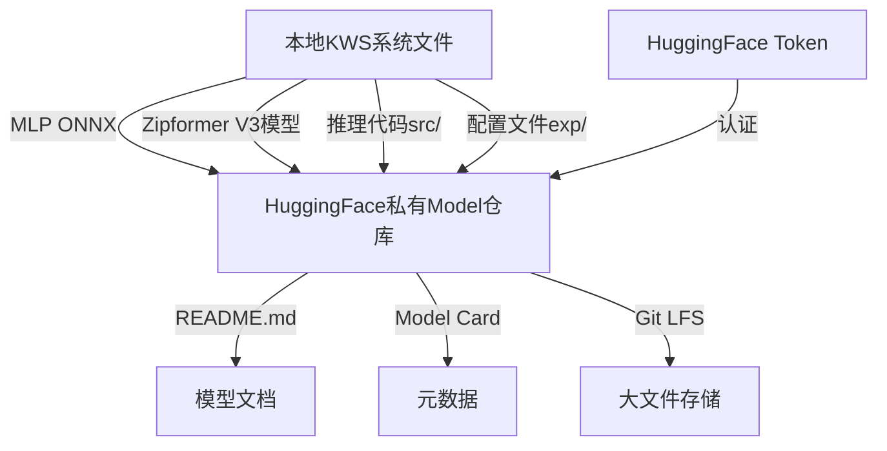

## 产品概述

将流式关键词识别（KWS）系统的完整部署文件上传到HuggingFace私有Model仓库，建立模型和推理代码的集中管理和分发点。

## 核心功能

- 创建HuggingFace私有Model仓库
- 上传MLP ONNX模型文件（12.37KB）
- 上传Zipformer V3模型文件（encoder/decoder/joiner int8版本，共4.2MB）
- 上传推理代码（src/目录）和配置文件
- 配置模型卡片和README文档
- 验证上传文件的完整性和可访问性

## 技术栈

- 版本控制：Git + GitHub
- 云平台：HuggingFace Hub
- 认证：HuggingFace Token认证
- 文件管理：HuggingFace git-lfs（大文件存储）
- 模型格式：ONNX、Zipformer int8量化

## 架构设计

### 系统架构



### 模块划分

- **仓库初始化模块**：创建私有Model仓库，配置基本信息和访问权限
- **文件上传模块**：分类上传模型文件、推理代码和配置文件，处理大文件git-lfs集成
- **文档配置模块**：编写README.md和model card，描述模型用途、使用方法、输入输出规范
- **验证测试模块**：验证上传文件的完整性、可访问性和模型推理的可用性

### 数据流

本地文件 → HuggingFace认证 → 创建仓库 → 配置git-lfs → 分类上传文件 → 更新元数据 → 文档配置 → 完整性验证

## 实现细节

### 关键代码结构

**Model Card配置**（YAML格式）：定义模型元数据，包括任务类型、模型架构、训练数据、性能指标和使用条件。

```
---
language:
  - zh
  - en
library_name: onnxruntime
license: apache-2.0
tags:
  - keyword-spotting
  - kws
  - streaming
  - onnx
  - zipformer
pipeline_tag: zero-shot-classification
---

# Streaming Keyword Spotting System
Model architecture: Zipformer + MLP Verifier
```

**上传脚本配置**：设置文件分类、大文件处理和上传顺序。

```python
# 文件映射表
files_config = {
    'models': ['mlp_verifier.onnx'],
    'kws_finetune_v3': ['encoder.onnx', 'decoder.onnx', 'joiner.onnx'],
    'src': ['inference.py', 'audio_processor.py', ...],
    'configs': ['config.yaml', 'model_config.json']
}

# git-lfs跟踪规则
lfs_patterns = ['*.onnx', '*.bin', '*.pt']
```

### 技术实现方案

**问题**：如何高效地管理和上传多个模型文件及代码到HuggingFace，确保完整性和可访问性？

**解决方案**：

1. 使用HuggingFace huggingface_hub SDK进行程序化上传，支持断点续传
2. 配置git-lfs处理大模型文件，避免git仓库过大
3. 分阶段上传：先上传配置和文档，再上传模型文件，最后验证
4. 使用model card标准化元数据，便于模型发现和使用

**关键技术**：HuggingFace hub-cli、git-lfs、huggingface_hub Python库

**实现步骤**：

- 初始化git仓库并配置git-lfs规则
- 创建HuggingFace Model仓库（私有模式）
- 组织本地文件目录结构
- 配置model card和README
- 上传文件并验证

## 推荐的扩展工具

### MCP

- **hf-mcp-server**
- 用途：与HuggingFace Hub进行交互，搜索和管理Model仓库，验证上传状态
- 预期结果：获取仓库详情、验证文件完整性、确认模型可访问性

- **github**
- 用途：创建GitHub仓库作为备份源码控制，管理版本和change log
- 预期结果：建立完整的版本历史和CI/CD流程

- **exa**（get_code_context_exa）
- 用途：搜索和获取HuggingFace上传和模型部署的最佳实践代码示例
- 预期结果：获得高质量的参考实现和最新API用法

### Skill

- **skill-creator**
- 用途：创建自定义技能，封装KWS模型到HuggingFace的上传和部署流程，便于后续重复使用
- 预期结果：可重用的上传流程skill，支持自动化和标准化部署