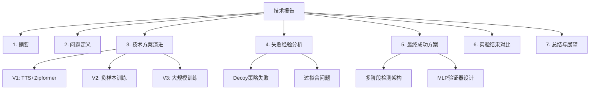

## Product Overview

撰写一篇完整的技术报告，详细记录"你好真真"关键词识别(KWS)模型从V1版本到最终多阶段检测方案的完整优化历程。报告将系统性地呈现问题分析、各版本技术迭代、失败经验总结以及最终成功方案的技术细节。

## Core Features

- **问题定义与背景介绍**：阐述关键词识别任务的技术挑战，定义FAR(误唤醒率)和FRR(漏唤醒率)评估指标
- **V1基线方案分析**：介绍TTS合成数据+Zipformer微调的初始方案及其FAR=44.07%的问题
- **V2负样本训练迭代**：分析引入负样本训练策略将FAR降至34.26%的改进过程
- **V3大规模训练尝试**：记录增加训练轮数和数据量导致FAR反升至72.22%的过拟合问题
- **Decoy策略失败分析**：总结Decoy混淆词策略导致FRR=82.64%的失败经验
- **多阶段检测成功方案**：详述V3+MLP验证器的最终方案，实现FAR=1.30%、FRR=0%的优异性能
- **经验总结与技术洞察**：提炼优化过程中的关键技术决策和可复用的方法论

## Tech Stack

- 文档格式：Markdown技术报告
- 图表工具：Mermaid流程图/架构图
- 代码展示：Python代码片段

## 报告架构设计

### 文档结构



### 核心章节规划

| 章节 | 内容要点 | 预计篇幅 |
| --- | --- | --- |
| 摘要 | 问题、方法、结果概述 | 300字 |
| 问题定义 | KWS任务、评估指标、挑战 | 500字 |
| 技术演进 | V1-V3各版本详细分析 | 1500字 |
| 失败分析 | Decoy策略、过拟合问题 | 800字 |
| 成功方案 | 多阶段检测架构详解 | 1000字 |
| 实验结果 | 性能对比表格和分析 | 500字 |
| 总结展望 | 经验提炼、未来方向 | 400字 |


### 关键数据结构

**性能指标记录**

```python
# 各版本性能指标
performance_metrics = {
    "V1_baseline": {"FAR": 44.07, "FRR": None, "method": "TTS+Zipformer"},
    "V2_negative": {"FAR": 34.26, "FRR": None, "method": "负样本训练"},
    "V3_scaled": {"FAR": 72.22, "FRR": 0, "method": "大规模训练"},
    "Decoy": {"FAR": None, "FRR": 82.64, "method": "混淆词策略"},
    "Final": {"FAR": 1.30, "FRR": 0, "method": "V3+MLP验证器"}
}
```

### 技术实现要点

1. **代码仓库分析**：需要探索现有代码库，提取各版本的技术实现细节
2. **实验数据整理**：收集训练日志、评估结果等支撑材料
3. **架构图绘制**：使用Mermaid绘制多阶段检测系统架构
4. **对比分析表**：制作各版本性能对比表格

## Agent Extensions

### SubAgent

- **code-explorer**
- Purpose: 探索项目代码库，提取各版本模型的技术实现细节、训练配置、模型架构等关键信息
- Expected outcome: 获取V1-V3各版本的代码实现、MLP验证器架构、训练参数等技术细节，为报告提供准确的技术描述

### MCP

- **github**
- Purpose: 查看项目的提交历史、版本变更记录，了解各版本迭代的时间线和具体改动
- Expected outcome: 获取完整的版本演进历史，包括各次重要提交的改动内容和时间节点