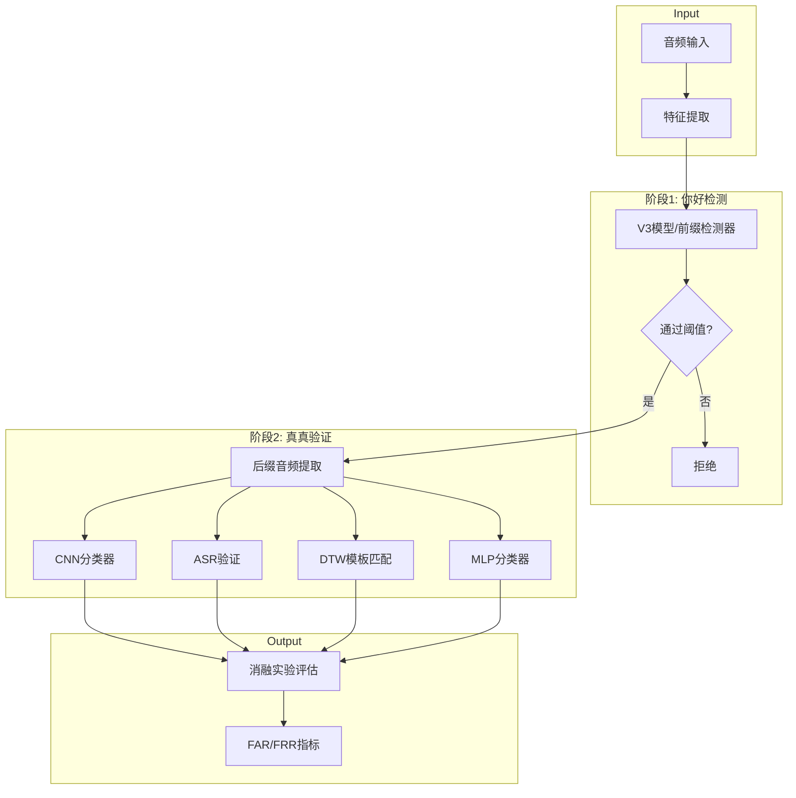
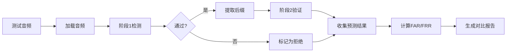

## Product Overview

多阶段关键词检测（KWS）消融实验系统，用于评估不同二阶段验证方案对"你好真真"唤醒词检测性能的影响。系统采用两阶段级联架构：阶段1检测"你好"前缀，阶段2对通过阶段1的样本进行"真真"后缀验证，通过消融实验确定最优组合方案。

## Core Features

- **多阶段检测框架**：实现阶段1（"你好"前缀检测）+ 阶段2（"真真"后缀验证）的级联检测架构
- **四种阶段2验证方案**：
- CNN分类器：使用卷积神经网络对"真真"音频片段进行二分类
- ASR验证：使用语音识别模型转录后缀音频，验证是否包含"真真"
- DTW模板匹配：使用动态时间规整算法与"真真"模板进行相似度匹配
- MLP分类器：使用多层感知机对音频特征进行分类
- **消融实验评估**：在测试集（正样本144个，负样本540个）上评估各方案的FAR和FRR
- **结果对比分析**：生成各方案的性能对比报告，确定最优组合方案（目标：FRR≤5%，FAR≤10%）

## Tech Stack

- **编程语言**：Python 3.x
- **深度学习框架**：PyTorch
- **音频处理**：torchaudio, librosa
- **ASR模型**：Hugging Face Transformers (Whisper/Paraformer)
- **DTW算法**：dtw-python / fastdtw
- **实验管理**：自定义消融实验框架
- **可视化**：matplotlib, pandas

## Tech Architecture

### System Architecture



### Module Division

| 模块 | 职责 | 关键技术 | 依赖 |
| --- | --- | --- | --- |
| **特征提取模块** | 音频加载、MFCC/Mel特征提取 | torchaudio, librosa | - |
| **阶段1检测模块** | "你好"前缀检测 | 现有V3模型 | 特征提取 |
| **后缀分割模块** | 从音频中提取"真真"后缀片段 | 音频切分算法 | 阶段1 |
| **CNN验证模块** | 卷积网络分类"真真" | PyTorch CNN | 后缀分割 |
| **ASR验证模块** | 语音识别+文本匹配 | Whisper/Paraformer | 后缀分割 |
| **DTW验证模块** | 模板匹配验证 | dtw-python | 后缀分割 |
| **MLP验证模块** | 多层感知机分类 | PyTorch MLP | 后缀分割 |
| **评估模块** | FAR/FRR计算、结果汇总 | pandas, matplotlib | 所有验证模块 |


### Data Flow



## Implementation Details

### Core Directory Structure

```
keyword-spotting/
├── experiments/
│   └── multi_stage_ablation/
│       ├── config.py              # 实验配置
│       ├── run_ablation.py        # 消融实验主入口
│       ├── stage1/
│       │   └── prefix_detector.py # 阶段1前缀检测器
│       ├── stage2/
│       │   ├── cnn_verifier.py    # CNN验证方案
│       │   ├── asr_verifier.py    # ASR验证方案
│       │   ├── dtw_verifier.py    # DTW验证方案
│       │   └── mlp_verifier.py    # MLP验证方案
│       ├── utils/
│       │   ├── audio_utils.py     # 音频处理工具
│       │   ├── feature_extractor.py # 特征提取
│       │   └── metrics.py         # 评估指标计算
│       └── results/               # 实验结果输出
│           └── ablation_report.md
```

### Key Code Structures

**验证器基类接口**：定义阶段2验证器的统一接口，所有验证方案继承此基类实现。

```python
from abc import ABC, abstractmethod
import torch

class BaseVerifier(ABC):
    """阶段2验证器基类"""
    
    @abstractmethod
    def verify(self, audio_segment: torch.Tensor) -> tuple[bool, float]:
        """
        验证音频片段是否为目标关键词
        Args:
            audio_segment: 后缀音频片段
        Returns:
            (is_accepted, confidence_score)
        """
        pass
    
    @abstractmethod
    def load_model(self, model_path: str) -> None:
        """加载预训练模型"""
        pass
```

**消融实验配置**：定义实验参数和各验证方案的配置。

```python
@dataclass
class AblationConfig:
    test_data_path: str = "/data/workspace/llm/audio-classification/dataset/kws_test_data_merged/"
    positive_samples: int = 144
    negative_samples: int = 540
    
    # 阶段1配置
    stage1_model_path: str = "models/v3_model.pt"
    stage1_threshold: float = 0.5
    
    # 阶段2验证方案
    verifiers: list[str] = field(default_factory=lambda: [
        "cnn", "asr", "dtw", "mlp"
    ])
    
    # 目标指标
    target_frr: float = 0.05
    target_far: float = 0.10
```

**评估指标计算**：计算FAR和FRR指标。

```python
def calculate_metrics(
    predictions: list[bool], 
    labels: list[bool]
) -> dict[str, float]:
    """
    计算FAR和FRR
    Returns:
        {"FAR": float, "FRR": float, "Accuracy": float}
    """
    pass
```

### Technical Implementation Plan

#### 1. 阶段1前缀检测器适配

- **问题**：需要复用现有V3模型检测"你好"前缀
- **方案**：封装V3模型，调整检测逻辑仅关注前缀部分
- **关键技术**：模型加载、阈值调优
- **步骤**：加载模型 → 提取前缀特征 → 二分类判断 → 返回置信度

#### 2. 后缀音频分割

- **问题**：需要从完整音频中准确提取"真真"后缀
- **方案**：基于时间戳或能量检测进行音频切分
- **关键技术**：VAD、音频切分
- **步骤**：检测语音边界 → 估计"你好"结束位置 → 提取后续片段

#### 3. CNN验证器实现

- **问题**：训练CNN对"真真"进行二分类
- **方案**：轻量级CNN架构，输入Mel频谱图
- **关键技术**：PyTorch CNN、数据增强
- **步骤**：准备训练数据 → 设计网络 → 训练 → 评估

#### 4. ASR验证器实现

- **问题**：使用ASR转录后验证文本
- **方案**：使用Whisper/Paraformer转录，检查是否包含"真真"
- **关键技术**：Hugging Face Transformers
- **步骤**：加载ASR模型 → 转录音频 → 文本匹配 → 返回结果

#### 5. DTW验证器实现

- **问题**：模板匹配验证"真真"
- **方案**：预录制"真真"模板，使用DTW计算相似度
- **关键技术**：MFCC特征、DTW算法
- **步骤**：提取模板特征 → 提取测试特征 → DTW距离计算 → 阈值判断

### Performance Optimization

- **批量推理**：CNN/MLP验证器支持批量处理提升效率
- **模型量化**：对CNN/MLP模型进行INT8量化减少推理时间
- **缓存机制**：缓存ASR模型和DTW模板避免重复加载

## Agent Extensions

### MCP

- **hf-mcp-server (model_search)**
- Purpose: 搜索适合中文语音识别的ASR模型（如Whisper、Paraformer）用于阶段2的ASR验证方案
- Expected outcome: 获取适合中文短语识别的预训练ASR模型信息和使用方法

- **hf-mcp-server (hf_doc_search)**
- Purpose: 查询Hugging Face Transformers库中ASR模型的使用文档
- Expected outcome: 获取ASR模型加载和推理的最佳实践代码

### SubAgent

- **code-explorer**
- Purpose: 探索现有项目结构，了解V3模型的实现细节和特征提取方法
- Expected outcome: 理解现有代码架构，确保新模块与现有代码兼容