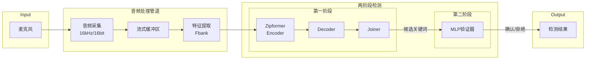
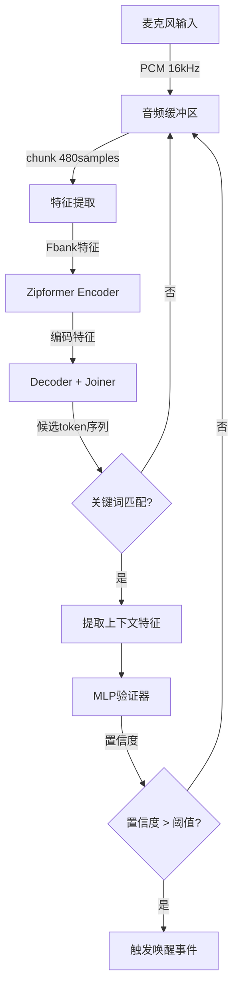

## Product Overview

面向嵌入式设备的流式关键词识别（Keyword Spotting, KWS）系统，支持麦克风实时音频采集，采用两阶段检测架构实现高精度低误报的关键词唤醒功能。系统将现有MLP验证器模型导出为ONNX格式以便嵌入式部署，并提供完整的Windows平台部署文档。

## Core Features

- **麦克风实时音频采集**：支持Windows平台麦克风输入，实现16kHz采样率的流式音频捕获
- **两阶段检测架构**：
- 第一阶段：V3 Zipformer流式ASR模型（encoder/decoder/joiner）进行初步关键词检测
- 第二阶段：MLP验证器对候选结果进行二次确认，降低误报率
- **MLP模型ONNX导出**：将PyTorch格式的MLP验证器（mlp_verifier.pt）转换为ONNX格式
- **流式处理管道**：基于现有参考代码构建完整的流式推理管道
- **Windows部署支持**：提供详细的Windows平台部署文档，包含环境配置、依赖安装和运行指南

## Tech Stack

- **编程语言**：Python 3.8+
- **深度学习框架**：PyTorch（模型加载与导出）、ONNX Runtime（推理引擎）
- **音频处理**：PyAudio / sounddevice（麦克风采集）、torchaudio（音频特征提取）
- **模型格式**：ONNX（跨平台部署）

## Tech Architecture

### System Architecture



### Module Division

| 模块名称 | 主要职责 | 关键技术 | 依赖关系 |
| --- | --- | --- | --- |
| audio_capture | 麦克风音频采集与流式缓冲 | PyAudio/sounddevice | 无 |
| feature_extractor | 音频特征提取（Fbank） | torchaudio | audio_capture |
| zipformer_asr | V3 Zipformer流式ASR推理 | ONNX Runtime | feature_extractor |
| mlp_verifier | MLP二阶段验证 | ONNX Runtime | zipformer_asr |
| kws_pipeline | 流式KWS主管道 | Python | 所有模块 |
| model_exporter | MLP模型ONNX导出工具 | PyTorch/ONNX | 无 |


### Data Flow



## Implementation Details

### Core Directory Structure

```
keyword-spotting/
├── src/
│   ├── audio/
│   │   ├── __init__.py
│   │   ├── capture.py          # 麦克风音频采集
│   │   └── feature.py          # Fbank特征提取
│   ├── models/
│   │   ├── __init__.py
│   │   ├── zipformer_stream.py # Zipformer流式推理封装
│   │   └── mlp_verifier.py     # MLP验证器推理封装
│   ├── pipeline/
│   │   ├── __init__.py
│   │   └── kws_stream.py       # 流式KWS主管道
│   └── utils/
│       ├── __init__.py
│       └── config.py           # 配置管理
├── tools/
│   └── export_mlp_onnx.py      # MLP模型ONNX导出脚本
├── models/
│   ├── encoder.onnx            # 已有V3模型
│   ├── decoder.onnx
│   ├── joiner.onnx
│   ├── mlp_verifier.pt         # 待导出的PyTorch模型
│   └── mlp_verifier.onnx       # 导出后的ONNX模型
├── docs/
│   └── windows_deployment.md   # Windows部署文档
├── main.py                     # 主程序入口
├── requirements.txt
└── README.md
```

### Key Code Structures

**音频采集接口**：定义流式音频捕获的核心接口，支持回调模式处理实时音频数据。

```python
class AudioCapture:
    def __init__(self, sample_rate: int = 16000, chunk_size: int = 480):
        """初始化音频采集器"""
        pass
    
    def start(self, callback: Callable[[np.ndarray], None]) -> None:
        """启动音频采集，通过回调处理音频块"""
        pass
    
    def stop(self) -> None:
        """停止音频采集"""
        pass
```

**流式KWS管道接口**：整合两阶段检测的主管道类。

```python
class StreamingKWSPipeline:
    def __init__(self, config: KWSConfig):
        """加载所有ONNX模型并初始化状态"""
        pass
    
    def process_chunk(self, audio_chunk: np.ndarray) -> Optional[DetectionResult]:
        """处理单个音频块，返回检测结果"""
        pass
    
    def reset(self) -> None:
        """重置流式状态"""
        pass
```

**MLP ONNX导出逻辑**：将PyTorch MLP模型转换为ONNX格式。

```python
def export_mlp_to_onnx(
    model_path: str,
    output_path: str,
    input_dim: int,
    opset_version: int = 13
) -> None:
    """导出MLP验证器为ONNX格式"""
    pass
```

### Technical Implementation Plan

#### MLP模型ONNX导出

1. **问题陈述**：将PyTorch格式的mlp_verifier.pt转换为ONNX格式以支持嵌入式部署
2. **解决方案**：使用torch.onnx.export进行模型导出，确保动态输入支持
3. **关键技术**：PyTorch ONNX导出、ONNX Runtime验证
4. **实现步骤**：

- 加载PyTorch模型并分析输入输出维度
- 构造dummy input进行导出
- 使用onnx.checker验证模型有效性
- 使用ONNX Runtime进行推理一致性验证

5. **测试策略**：对比PyTorch和ONNX Runtime输出的数值一致性

#### 流式音频处理

1. **问题陈述**：实现低延迟的麦克风音频采集与流式处理
2. **解决方案**：使用PyAudio回调模式，配合环形缓冲区
3. **关键技术**：PyAudio、numpy环形缓冲
4. **实现步骤**：

- 配置音频设备参数（16kHz、16bit、单声道）
- 实现回调函数处理音频块
- 构建特征提取管道

5. **测试策略**：验证音频采集延迟和特征提取正确性

### Integration Points

- **V3 Zipformer模型**：通过ONNX Runtime加载encoder/decoder/joiner三个模型文件
- **MLP验证器**：导出后通过ONNX Runtime加载推理
- **音频设备**：通过PyAudio访问系统麦克风设备

## Technical Considerations

### Performance Optimization

- 使用ONNX Runtime的多线程推理加速
- 音频缓冲区大小优化以平衡延迟和CPU负载
- 特征提取采用增量计算避免重复处理

### Logging

- 记录音频采集状态和错误
- 记录每次检测的置信度和耗时
- 支持调试模式输出详细推理信息

## Agent Extensions

### SubAgent

- **code-explorer**
- Purpose：探索现有代码库结构，分析V3模型推理代码和流式处理参考代码的实现细节
- Expected outcome：理解现有代码架构，确定可复用的模块和需要新增的组件

### MCP

- **github**
- Purpose：管理代码版本，创建分支和提交代码变更
- Expected outcome：代码变更被正确提交到仓库

- **hf-mcp-server**
- Purpose：搜索Hugging Face文档获取ONNX导出和流式推理的最佳实践
- Expected outcome：获取sherpa-onnx或类似项目的流式KWS实现参考