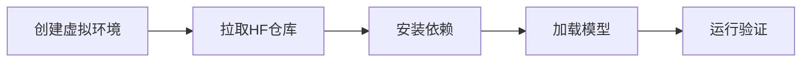

## 产品概述

创建一个隔离的测试环境，用于验证HuggingFace私有仓库Heehobino/streaming-kws中的流式关键词检测(KWS)模型是否能够成功加载和运行。

## 核心功能

- 创建独立的Python虚拟环境，确保测试环境与现有项目隔离
- 从HuggingFace Hub拉取私有仓库Heehobino/streaming-kws的完整内容
- 安装仓库所需的依赖项（requirements.txt）
- 按照README文档中的指示加载ONNX模型文件（encoder/decoder/joiner.int8.onnx、mlp_verifier.onnx）
- 执行main.py验证模型推理功能是否正常工作

## 技术栈

- 运行环境：Python 3.x + 虚拟环境（venv）
- 模型格式：ONNX Runtime（用于加载.onnx模型文件）
- 仓库管理：HuggingFace Hub CLI / huggingface_hub Python库
- 依赖管理：pip + requirements.txt

## 技术架构

### 系统架构

本任务为测试验证流程，采用线性执行架构：



### 模块划分

- **环境隔离模块**：创建独立的Python虚拟环境，避免与现有项目冲突
- **仓库获取模块**：使用HuggingFace Hub从私有仓库拉取代码和模型
- **依赖安装模块**：解析requirements.txt并安装所需包
- **模型验证模块**：加载ONNX模型并执行推理测试

### 数据流

1. 用户认证 → HuggingFace Hub API
2. 仓库克隆 → 本地测试目录
3. 依赖安装 → 虚拟环境
4. 模型加载 → ONNX Runtime
5. 推理执行 → 验证结果输出

## 实现细节

### 核心目录结构

```
/data/workspace/llm/keyword-spotting/
├── test-hf-repo/                    # 新建：隔离测试目录
│   ├── venv/                        # 新建：Python虚拟环境
│   └── streaming-kws/               # 新建：从HF拉取的仓库
│       ├── main.py                  # 入口脚本
│       ├── requirements.txt         # 依赖列表
│       ├── README.md                # 使用说明
│       ├── src/                     # 推理代码
│       └── models/                  # ONNX模型文件
│           ├── encoder.int8.onnx
│           ├── decoder.int8.onnx
│           ├── joiner.int8.onnx
│           └── mlp_verifier.onnx
```

### 关键代码结构

**环境创建命令**：

```
python -m venv test-hf-repo/venv
source test-hf-repo/venv/bin/activate
```

**HuggingFace仓库拉取**：

```python
from huggingface_hub import snapshot_download

snapshot_download(
    repo_id="Heehobino/streaming-kws",
    local_dir="test-hf-repo/streaming-kws",
    repo_type="model"
)
```

### 技术实现计划

1. **问题**：需要隔离测试环境

- **方案**：使用Python venv创建独立虚拟环境
- **步骤**：创建目录 → 初始化venv → 激活环境

2. **问题**：拉取HuggingFace私有仓库

- **方案**：使用huggingface_hub库的snapshot_download
- **技术**：需要HF认证token（用户已登录为Heehobino）
- **步骤**：验证认证 → 下载仓库 → 确认文件完整性

3. **问题**：验证模型运行

- **方案**：按README指示执行main.py
- **步骤**：安装依赖 → 运行脚本 → 检查输出结果

## Agent Extensions

### MCP

- **hf-mcp-server**
- 用途：获取HuggingFace仓库详情、验证用户认证状态、拉取仓库内容
- 预期结果：成功获取Heehobino/streaming-kws仓库的完整信息和内容，确认用户认证有效

### SubAgent

- **code-explorer**
- 用途：探索拉取后的仓库结构，查看README内容和main.py代码
- 预期结果：理解仓库结构和运行指示，确认模型文件和代码完整性